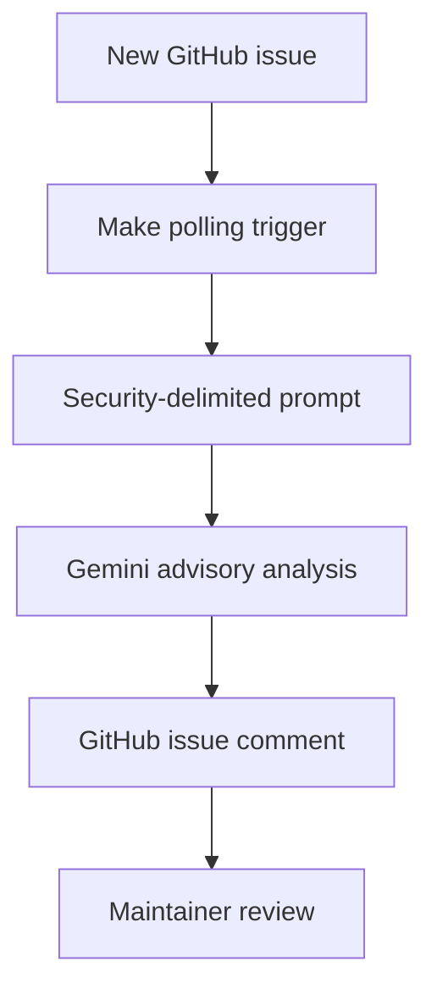

# Architecture

The workflow is intentionally linear. It has no command runner, browsing step, secret reader, code writer, pull-request action, or deployment action.

## Trust boundaries

| Data | Trust level | Handling |
| --- | --- | --- |
| Issue title/body | Untrusted | Delimited as evidence; never treated as instructions |
| Model response | Untrusted recommendation | Posted as an advisory comment for human review |
| Make configuration | Trusted control plane | Must not contain unnecessary secrets |
| Maintainer decision | Authoritative | Required before repository changes |

## Design trade-off

SafeTriage gives up autonomous remediation to keep the public-input workflow narrow. A maintainer gets structured analysis quickly without granting an LLM authority to execute code or mutate repository state beyond one comment.
